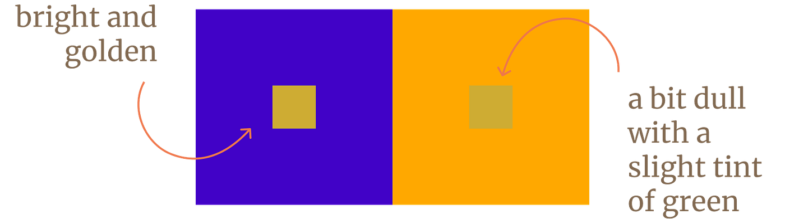
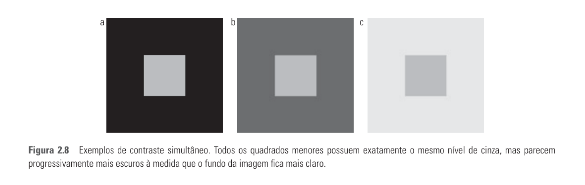
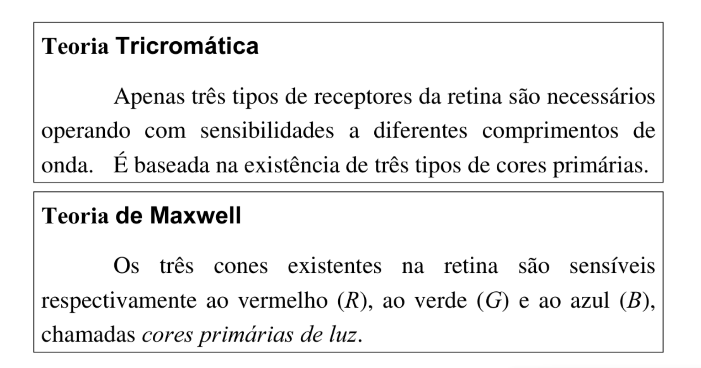

# Segunda Aula de Computação Visual!
## O que você aprendeu durante essa aula?
 Durante essa aula algo muito interessante que aprendi foi como a diferença de contraste de cores próximas podem mudar a percepção de determinada cor como é possivel observar nos seguintes exemplos: 
 
 
 Podemos dizer que isso é um efeito devido ao contraste simultâneo.

## Teorias Apresentadas

